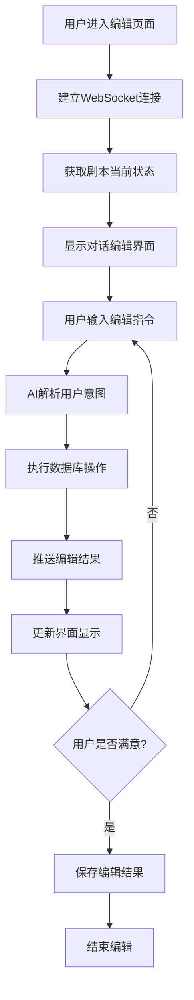

# 剧本对话式编辑系统设计方案

## 1. 产品概述

本系统旨在为剧本编辑页面提供一个智能对话式编辑功能，用户可以通过自然语言与AI助手对话的方式，完成剧本的各项编辑工作，包括角色设计、证据管理、场景设置等。系统通过WebSocket实现实时通信，后端维护编辑上下文和数据库操作。

## 2. 核心功能

### 2.1 用户角色

| 角色    | 权限     | 功能范围                            |
| ----- | ------ | ------------------------------- |
| 剧本创作者 | 完整编辑权限 | 可编辑所有剧本元素，包括基础信息、角色、证据、场景、背景故事等 |
| 协作编辑者 | 受限编辑权限 | 可编辑指定模块，如仅编辑角色或证据               |

### 2.2 功能模块

我们的对话式剧本编辑系统包含以下主要功能：

1. **对话编辑界面**：智能对话框，支持自然语言交互，实时显示编辑结果
2. **上下文管理**：维护编辑会话状态，智能理解编辑意图
3. **实时同步**：WebSocket通信，确保前后端数据一致性
4. **智能助手**：AI驱动的编辑建议，自动补全，内容生成

### 2.3 页面详情

| 页面名称   | 模块名称   | 功能描述                           |
| ------ | ------ | ------------------------------ |
| 剧本编辑页面 | 对话编辑器  | 提供聊天界面，支持文本输入、语音输入，显示对话历史和编辑建议 |
| 剧本编辑页面 | 实时预览面板 | 实时显示剧本当前状态，包括角色列表、证据清单、场景信息等   |
| 剧本编辑页面 | 状态面板   | 显示当前编辑状态，系统提示信息                |

## 3. 核心流程

### 3.1 用户编辑流程

用户进入剧本编辑页面后，可以通过以下方式进行编辑：

1. **初始化连接**：页面加载时建立WebSocket连接，获取剧本当前状态
2. **对话编辑**：用户在对话框中输入编辑指令，如"添加一个名叫张三的角色"
3. **AI理解与执行**：后端AI解析用户意图，执行相应的数据库操作
4. **实时反馈**：编辑结果通过WebSocket推送给前端，更新界面显示
5. **确认与调整**：用户确认编辑结果，或继续对话进行调整

### 3.2 数据同步流程

编辑操作的数据同步处理：

1. **数据验证**：验证编辑操作的有效性
2. **状态更新**：更新剧本数据状态
3. **界面同步**：同步更新前端显示
4. **持久化存储**：保存编辑结果到数据库



## 4. 技术架构设计

### 4.1 前端架构

**技术栈**：Next.js + React + TypeScript + Shadcn/ui + Zustand

**核心组件**：

* `ChatEditor`：对话编辑器主组件

* `ScriptPreview`：剧本实时预览组件

* `StatusPanel`：状态面板组件

**状态管理**：

```typescript
interface ChatEditorState {
  // WebSocket连接状态
  isConnected: boolean;
  sessionId: string;
  
  // 对话状态
  messages: ChatMessage[];
  isTyping: boolean;
  
  // 剧本编辑状态
  scriptData: ScriptData;
  editHistory: EditOperation[];
  
  // 编辑状态
  editStatus: EditStatus;
}
```

### 4.2 后端架构

**技术栈**：FastAPI + SQLAlchemy + PostgreSQL + Redis

**核心模块**：

* `ChatEditController`：对话编辑控制器

* `ScriptContextManager`：剧本上下文管理器

* `AIEditAssistant`：AI编辑助手

* `DataSyncManager`：数据同步管理器

**数据结构**：

```python
class EditSession:
    session_id: str
    script_id: int
    user_id: int
    context: Dict[str, Any]
    edit_history: List[EditOperation]
    created_at: datetime
    last_activity: datetime

class EditOperation:
    operation_id: str
    session_id: str
    operation_type: str  # 'create', 'update', 'delete'
    target_type: str     # 'character', 'evidence', 'location', 'background'
    target_id: Optional[int]
    data: Dict[str, Any]
    timestamp: datetime
```

### 4.3 WebSocket通信协议

**消息类型定义**：

```typescript
interface WebSocketMessage {
  type: 'chat_edit' | 'script_update' | 'collaboration' | 'error';
  session_id: string;
  data: any;
  timestamp: string;
}

// 对话编辑消息
interface ChatEditMessage {
  type: 'chat_edit';
  data: {
    message_type: 'user_input' | 'ai_response' | 'edit_result';
    content: string;
    edit_operations?: EditOperation[];
  };
}

// 剧本更新消息
interface ScriptUpdateMessage {
  type: 'script_update';
  data: {
    update_type: 'character' | 'evidence' | 'location' | 'background';
    operation: 'create' | 'update' | 'delete';
    target_id?: number;
    updated_data: any;
  };
}
```

## 5. 用户界面设计

### 5.1 设计风格

* **主色调**：深色主题，主色为紫色(#8B5CF6)，辅助色为青色(#06B6D4)

* **按钮样式**：圆角按钮，支持渐变色和悬停效果

* **字体**：Inter字体，主要文字16px，辅助文字14px

* **布局风格**：分栏布局，左侧对话区域，右侧预览区域

* **图标风格**：使用Lucide图标库，简洁现代风格

### 5.2 页面设计概览

| 页面名称   | 模块名称   | UI元素                                    |
| ------ | ------ | --------------------------------------- |
| 剧本编辑页面 | 对话编辑器  | 聊天气泡样式消息列表，底部输入框带发送按钮，支持Markdown渲染，代码高亮 |
| 剧本编辑页面 | 实时预览面板 | Tab标签页布局，包含剧本信息、角色管理、证据管理、场景管理、预览模式等标签页 |
| 剧本编辑页面 | 操作历史面板 | 时间线样式操作记录，支持点击撤销，变更对比视图                 |
| 剧本编辑页面 | 协作状态栏  | 头像显示在线用户，彩色指示器显示编辑状态，冲突警告提示             |

### 5.3 实时预览面板Tab设计

```
┌─────────────────┬─────────────────┐
│   对话编辑区     │   实时预览区     │
│                │                │
│  [输入框]       │  ┌─────────────┐ │
│  [发送按钮]     │  │ Tab导航栏   │ │
│  [快捷操作]     │  ├─────────────┤ │
│                │  │ Tab内容区   │ │
│                │  │             │ │
└─────────────────┴─────────────────┘
```

**Tab页面设计**：
- **剧本信息**：显示剧本基础信息、背景故事
- **角色管理**：角色列表、详细信息、关系图
- **证据管理**：证据列表、分类展示、关联信息
- **场景管理**：场景列表、描述信息、连接关系
- **预览模式**：整体剧本预览、导出功能

### 5.3 响应式设计

系统采用桌面优先设计，支持平板和移动端适配。在移动端，对话编辑器和预览面板采用标签页切换方式显示，确保良好的触控体验。

## 6. 实现计划

### 6.1 第一阶段：基础对话编辑功能

**目标**：实现基本的对话式编辑功能

**任务**：

1. 创建对话编辑器组件
2. 实现WebSocket通信
3. 开发AI编辑助手基础功能
4. 实现角色、证据、场景的基础CRUD操作

**预期时间**：2周

### 6.2 第二阶段：上下文管理和历史记录

**目标**：完善编辑体验，支持撤销重做

**任务**：

1. 实现编辑上下文管理
2. 开发操作历史功能
3. 实现撤销重做机制
4. 优化AI理解能力

**预期时间**：1.5周

### 6.3 第三阶段：高级功能

**目标**：完善系统功能和用户体验

**任务**：

1. 实现智能建议系统
2. 开发批量操作功能
3. 添加导入导出功能
4. 优化AI理解能力

**预期时间**：2周

### 6.4 第四阶段：优化和完善

**目标**：提升用户体验，优化性能

**任务**：

1. 性能优化
2. 错误处理完善
3. 用户体验优化
4. 测试和调试

**预期时间**：1周

## 7. 风险评估与解决方案

### 7.1 技术风险

**风险**：WebSocket连接不稳定
**解决方案**：实现自动重连机制，本地缓存编辑操作

**风险**：AI理解准确性不足
**解决方案**：提供编辑模板和快捷指令，支持手动确认

**风险**：数据同步延迟
**解决方案**：优化WebSocket通信，实现本地缓存机制

### 7.2 用户体验风险

**风险**：学习成本高
**解决方案**：提供新手引导，常用指令提示

**风险**：响应延迟
**解决方案**：实现本地预览，异步处理非关键操作

## 8. 成功指标

* **功能完整性**：支持所有剧本元素的对话式编辑

* **响应速度**：AI响应时间 < 2秒，界面更新延迟 < 500ms

* **稳定性**：WebSocket连接成功率 > 99%，编辑操作成功率 > 99.5%

* **用户体验**：用户满意度 > 4.5/5，学习时间 < 10分钟

* **数据一致性**：前后端数据同步准确率 > 99.9%

