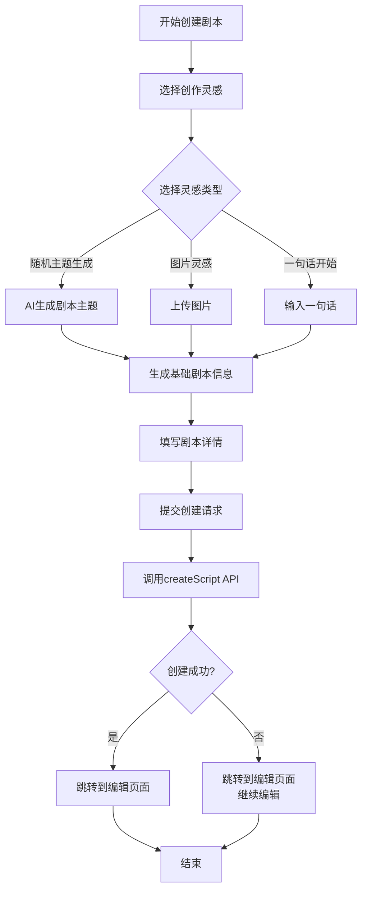

# 剧本创建完整流程文档

本文档详细描述了剧本从灵感到创建完成的整个流程，包括前端界面交互和后端API处理。

## 整体流程概述



## 详细步骤说明

### 1. 灵感选择阶段

用户首先进入剧本创建页面（`/script-manager/create`），需要选择创作灵感来源。系统提供三种灵感类型：

#### 1.1 随机主题生成

- 使用AI生成独特剧本主题
- 用户只需点击选择，系统自动生成主题
- 实现代码在 `frontend/src/pages/script-manager/create.tsx` 的 [generateRandomTheme](file:///Users/archersmac/Documents/jubensha/frontend/src/pages/script-manager/create.tsx#L71-L87) 函数中

#### 1.2 图片灵感

- 用户上传一张图片作为创作灵感
- 系统基于图片内容生成相关剧本元素
- 当前版本为UI占位，后续可扩展实现

#### 1.3 一句话开始

- 用户输入一句话描述想要的剧本内容
- 系统基于这句话扩展成完整剧本
- 输入内容保存在 [inspirationInput](file:///Users/archersmac/Documents/jubensha/frontend/src/pages/script-manager/create.tsx#L59-L59) 状态中

### 2. 信息生成阶段

根据用户选择的灵感类型，系统会调用AI服务生成基础剧本信息。

#### 2.1 前端实现

- 调用 [generateScriptInfo](file:///Users/archersmac/Documents/jubensha/frontend/src/pages/script-manager/create.tsx#L90-L119) 函数
- 通过 `scriptService.generateScriptInfo` 方法请求后端API
- 请求参数包括主题、剧本类型偏好和玩家人数

#### 2.2 后端实现

- API端点：`POST /api/scripts/generate-info`
- 路由处理函数：[generate_script_info](file:///Users/archersmac/Documents/jubensha/src/api/routes/script_routes.py#L57-L100)
- 使用LLM服务生成剧本基础信息
- 返回包含标题、简介、背景故事、建议类型和建议玩家人数的JSON数据

### 3. 详情填写阶段

用户需要填写完整的剧本信息：

- **标题**：剧本的名称
- **类型**：如推理悬疑、情感治愈、恐怖惊悚、欢乐聚会、古风历史、现代都市等
- **玩家人数**：支持4人到9人以上的不同配置
- **剧本简介**：对剧本内容的详细描述

这些信息保存在 [formData](file:///Users/archersmac/Documents/jubensha/frontend/src/pages/script-manager/create.tsx#L63-L68) 状态对象中。

### 4. 剧本创建阶段

当用户填写完所有必要信息后，可以提交创建请求。系统执行以下操作：

#### 4.1 前端实现

- 调用 [handleCreateScript](file:///Users/archersmac/Documents/jubensha/frontend/src/pages/script-manager/create.tsx#L121-L151) 函数
- 通过 `scriptService.createScript` 方法请求后端API
- 请求参数包括：
  - title: 剧本标题
  - description: 剧本简介
  - player_count: 玩家人数
  - estimated_duration: 预估时长（默认180分钟）
  - difficulty_level: 难度等级（默认medium）
  - category: 分类（默认推理）
  - tags: 标签（默认空数组）
  - inspiration_type: 灵感类型
  - inspiration_content: 灵感内容
  - background_story: 背景故事

#### 4.2 后端实现

- API端点：`POST /api/scripts/`
- 路由处理函数：[create_script](file:///Users/archersmac/Documents/jubensha/src/api/routes/script_routes.py#L133-L164)
- 使用 ScriptRepository 创建剧本记录
- 如果提供了背景故事，创建背景故事记录

### 5. 跳转编辑阶段

无论创建成功与否，系统都会跳转到剧本编辑页面：

- **创建成功**：跳转到具体剧本的编辑页面（带有剧本ID）
- **创建失败**：跳转到新建剧本的编辑页面，用户仍可继续编辑

这种设计确保用户不会因为网络或其他技术问题丢失创作进度。

## 关键代码组件

### 前端组件

- `frontend/src/pages/script-manager/create.tsx` - 剧本创建页面
- `frontend/src/services/scriptService.ts` - 剧本相关API服务

### 后端组件

- `src/api/routes/script_routes.py` - 剧本相关API路由
- `src/db/repositories/script_repository.py` - 剧本数据访问层
- `src/services/llm_service.py` - AI服务接口

## 数据模型

### 前端请求模型

```typescript
interface CreateScriptRequest {
  title: string;
  description: string;
  player_count: number;
  estimated_duration?: number;
  difficulty_level?: string;
  tags?: string[];
  category?: string;
  inspiration_type?: string;
  inspiration_content?: string;
  background_story?: string;
}
```

### 后端请求模型

```python
class CreateScriptRequest(BaseModel):
    title: str
    description: str
    player_count: int
    estimated_duration: Optional[int] = 180
    difficulty_level: Optional[str] = "medium"
    category: Optional[str] = "推理"
    tags: Optional[List[str]] = []
    inspiration_type: Optional[str] = None
    inspiration_content: Optional[str] = None
    background_story: Optional[str] = None
```

## 错误处理

系统在设计上考虑了以下错误情况：

1. 网络连接问题
2. 服务器响应错误
3. 数据验证失败
4. 数据库操作异常

对于这些情况，系统会：

- 记录错误日志
- 提供用户友好的错误提示
- 允许用户继续操作，不会丢失已输入的内容

## 相关API接口

### 剧本信息生成接口

- **URL**: `POST /api/scripts/generate-info`
- **功能**: 根据主题生成剧本基础信息
- **请求参数**:
  - theme: string - 主题内容
  - script_type: string (可选) - 剧本类型偏好
  - player_count: string (可选) - 玩家人数偏好

### 剧本创建接口

- **URL**: `POST /api/scripts/`
- **功能**: 创建新剧本
- **请求参数**: 参见CreateScriptRequest模型