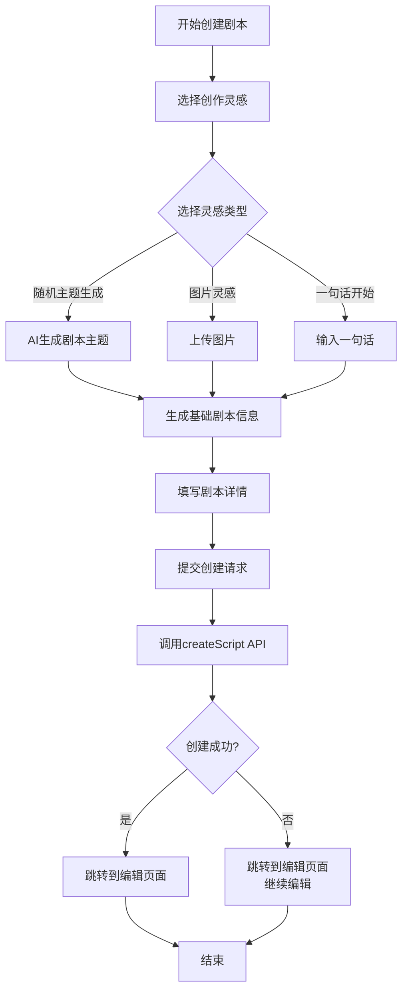

# 剧本创建流程文档

本文档详细描述了剧本从灵感到创建完成的整个流程。

## 整体流程概述

## 详细步骤说明

### 1. 灵感选择阶段

用户首先进入剧本创建页面，需要选择创作灵感来源。系统提供三种灵感类型：

1. **随机主题生成**

   * 使用AI生成独特剧本主题

   * 用户只需点击选择，系统自动生成主题

2. **图片灵感**

   * 用户上传一张图片作为创作灵感

   * 系统基于图片内容生成相关剧本元素

3. **一句话开始**

   * 用户输入一句话描述想要的剧本内容

   * 系统基于这句话扩展成完整剧本

### 2. 信息生成阶段

根据用户选择的灵感类型，系统会调用AI服务生成基础剧本信息：

* 剧本标题

* 剧本简介（100-200字）

* 背景故事（200-300字）

* 建议的剧本类型

* 建议的玩家人数

此阶段确保用户有一个良好的起点来继续创作。

### 3. 详情填写阶段

用户需要填写完整的剧本信息：

* **标题**：剧本的名称

* **类型**：如推理悬疑、情感治愈、恐怖惊悚、欢乐聚会、古风历史、现代都市等

* **玩家人数**：支持4人到9人以上的不同配置

* **剧本简介**：对剧本内容的详细描述

### 4. 剧本创建阶段

当用户填写完所有必要信息后，可以提交创建请求。系统执行以下操作：

1. 准备创建剧本的数据
2. 调用后端API创建剧本记录
3. 如果提供了背景故事，同时创建背景故事记录
4. 返回创建结果

相关API接口：

* `POST /api/scripts/` - 创建新剧本

* `POST /api/scripts/generate-info` - 根据主题生成剧本基础信息

### 5. 跳转编辑阶段

无论创建成功与否，系统都会跳转到剧本编辑页面：

* **创建成功**：跳转到具体剧本的编辑页面（带有剧本ID）

* **创建失败**：跳转到新建剧本的编辑页面，用户仍可继续编辑

这种设计确保用户不会因为网络或其他技术问题丢失创作进度。

## 关键代码组件

### 前端组件

* `frontend/src/pages/script-manager/create.tsx` - 剧本创建页面

* `frontend/src/services/scriptService.ts` - 剧本相关API服务

### 后端组件

* `src/api/routes/script_routes.py` - 剧本相关API路由

* `src/db/repositories/script_repository.py` - 剧本数据访问层

## 数据模型

### CreateScriptRequest

用于创建剧本的请求模型：

* title: string - 剧本标题

* description: string - 剧本简介

* player\_count: number - 玩家人数

* estimated\_duration: number (可选) - 预估时长

* difficulty\_level: string (可选) - 难度等级

* category: string (可选) - 分类

* tags: string\[] (可选) - 标签

* inspiration\_type: string (可选) - 灵感类型

* inspiration\_content: string (可选) - 灵感内容

* background\_story: string (可选) - 背景故事

## 错误处理

系统在设计上考虑了以下错误情况：

1. 网络连接问题
2. 服务器响应错误
3. 数据验证失败
4. 数据库操作异常

对于这些情况，系统会：

* 记录错误日志

* 提供用户友好的错误提示

* 允许用户继续操作，不会丢失已输入的内容

