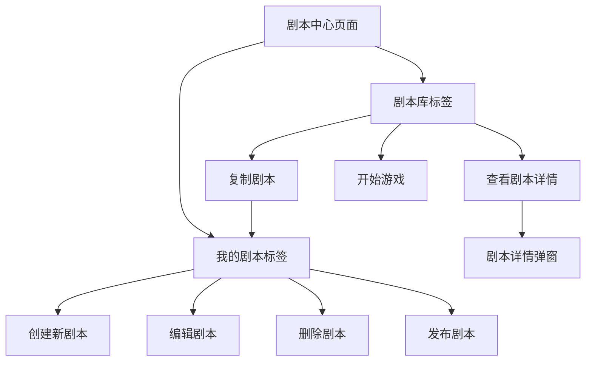

## 1. 产品概述

本文档旨在规划将剧本管理页面（script-manager）和剧本库页面（scripts）合并为一个统一的剧本中心页面，提供更好的用户体验和更高效的功能整合。

合并后的页面将成为用户管理个人剧本和浏览公共剧本库的统一入口，减少页面跳转，提升操作效率。

## 2. 核心功能

### 2.1 用户角色

| 角色 | 注册方式 | 核心权限 |
|------|----------|----------|
| 普通用户 | 默认用户访问 | 可创建、编辑、删除个人剧本，浏览和复制公共剧本库内容 |

### 2.2 功能模块

合并后的剧本中心页面包含以下核心模块：

1. **统一剧本中心页面**：顶部导航栏、搜索筛选区域、标签页切换、剧本展示区域
2. **剧本详情弹窗**：剧本详细信息展示、操作按钮区域

### 2.3 页面详情

| 页面名称 | 模块名称 | 功能描述 |
|----------|----------|----------|
| 剧本中心页面 | 顶部导航栏 | 显示页面标题、用户信息、创建新剧本按钮 |
| 剧本中心页面 | 搜索筛选区域 | 全局搜索框、高级筛选面板（分类、难度、人数、时长、评分） |
| 剧本中心页面 | 标签页切换 | "我的剧本"和"剧本库"两个标签页，支持快速切换 |
| 剧本中心页面 | 剧本展示区域 | 网格/列表视图切换、剧本卡片展示、分页加载 |
| 剧本详情弹窗 | 详情展示 | 剧本基本信息、角色介绍、游戏规则、用户评价 |
| 剧本详情弹窗 | 操作按钮 | 根据剧本来源显示不同操作（编辑/删除/发布/查看/复制/开始游戏） |

## 3. 核心流程

用户访问剧本中心页面后，默认显示"我的剧本"标签页。用户可以：
- 在"我的剧本"中创建、编辑、删除、发布个人剧本
- 切换到"剧本库"浏览公共剧本，查看详情并复制到个人剧本
- 使用搜索和筛选功能快速找到目标剧本
- 点击剧本卡片查看详细信息，执行相应操作

## 4. 用户界面设计

### 4.1 设计风格

- **主色调**：深色主题，主色为紫色（#8B5CF6），辅助色为粉色（#EC4899）
- **按钮样式**：圆角设计，渐变背景，悬停效果
- **字体**：现代无衬线字体，主要文字16px，辅助文字14px，小字12px
- **布局风格**：卡片式布局，毛玻璃效果，顶部固定导航
- **图标风格**：使用Lucide React图标库，线性风格

### 4.2 页面设计概览

| 页面名称 | 模块名称 | UI元素 |
|----------|----------|--------|
| 剧本中心页面 | 顶部导航栏 | 深色半透明背景，毛玻璃效果，左侧标题+图标，右侧创建按钮（紫色渐变） |
| 剧本中心页面 | 搜索筛选区域 | 搜索框（圆角，图标前缀），筛选按钮，视图切换按钮组 |
| 剧本中心页面 | 标签页切换 | 深色背景，选中状态紫色渐变，未选中状态灰色，图标+文字 |
| 剧本中心页面 | 剧本展示区域 | 响应式网格布局，卡片悬停效果，状态徽章，操作按钮 |
| 剧本详情弹窗 | 详情展示 | 大尺寸弹窗，左侧图片，右侧信息，标签页切换内容区域 |
| 剧本详情弹窗 | 操作按钮 | 底部按钮组，主要操作紫色渐变，次要操作边框样式 |

### 4.3 响应式设计

采用桌面优先的响应式设计，支持移动端适配：
- 桌面端：多列网格布局，侧边筛选面板
- 平板端：减少列数，筛选面板可收起
- 移动端：单列布局，筛选面板改为底部抽屉
- 支持触摸交互优化，按钮尺寸适合手指点击