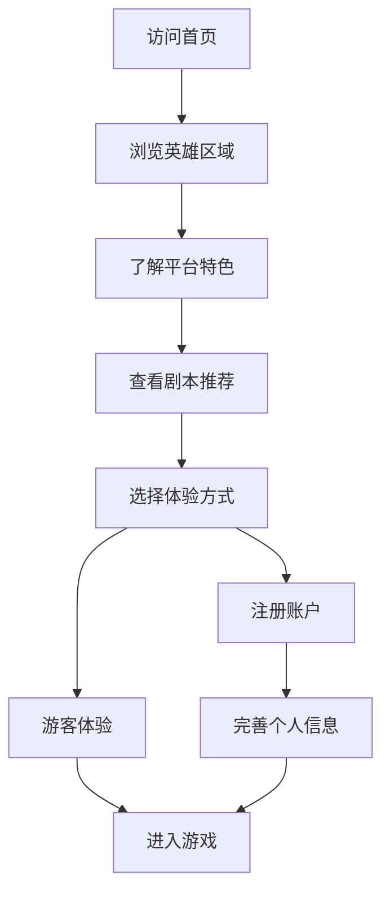
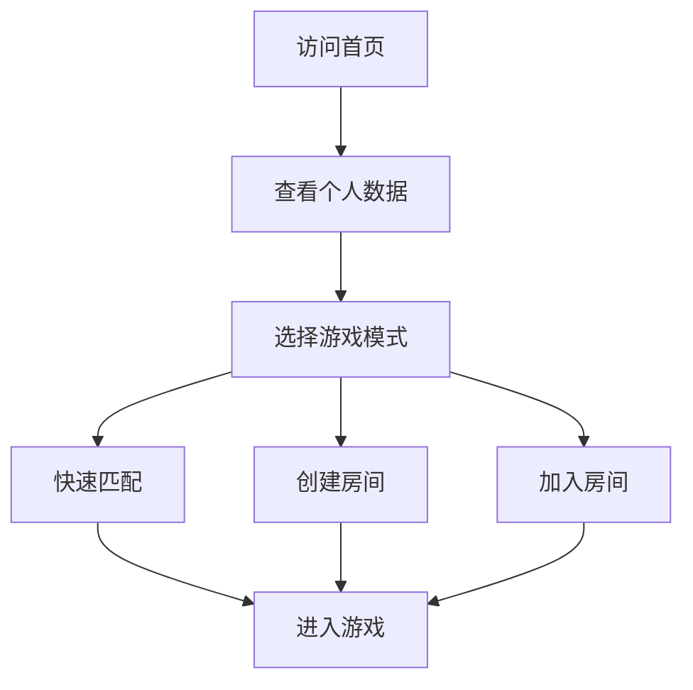

# 首页全面优化需求文档

## 1. 产品概述

对AI剧本杀平台首页进行全面的现代化改造，提升用户体验、视觉美观度和功能易用性。通过引入现代设计理念、优化交互流程和增强视觉效果，打造一个吸引用户、易于使用且具有强烈品牌特色的首页。

## 2. 核心功能

### 2.1 用户角色

| 角色 | 访问方式 | 核心权限 |
|------|----------|----------|
| 游客用户 | 直接访问 | 浏览剧本信息，体验演示功能，注册账户 |
| 注册用户 | 登录访问 | 完整游戏功能，个人数据展示，快速开始游戏 |

### 2.2 功能模块

优化后的首页包含以下核心模块：

1. **英雄区域**: 品牌展示，核心价值传达，主要行动按钮
2. **快速开始区域**: 游戏设置，剧本选择，房间创建/加入
3. **特色展示区域**: 平台亮点，AI功能介绍，用户评价
4. **剧本推荐区域**: 热门剧本，新增剧本，个性化推荐
5. **统计展示区域**: 平台数据，用户成就，社区活跃度

### 2.3 页面详情

| 页面名称 | 模块名称 | 功能描述 |
|----------|----------|----------|
| 首页 | 英雄区域 | 动态背景，品牌标语，主要CTA按钮，视觉冲击力强的设计 |
| 首页 | 导航栏 | 响应式导航，用户状态显示，快速访问功能 |
| 首页 | 快速开始 | 智能剧本推荐，一键开始游戏，房间管理功能 |
| 首页 | 特色展示 | AI功能亮点，平台优势，交互式演示 |
| 首页 | 剧本推荐 | 卡片式布局，筛选功能，详细信息预览 |
| 首页 | 用户反馈 | 评价展示，社区动态，成功案例 |
| 首页 | 页脚信息 | 联系方式，法律信息，社交媒体链接 |

## 3. 核心流程

### 新用户首次访问流程

### 老用户快速开始流程

## 4. 用户界面设计

### 4.1 设计风格

- **主色调**: 深紫色到蓝色渐变 (#1a1a2e → #16213e → #0f3460)，营造神秘科技感
- **辅助色**: 紫色系 (#6366f1, #8b5cf6, #a855f7)，金色点缀 (#fbbf24)
- **按钮样式**: 现代圆角设计，渐变背景，微动画效果，悬停状态变化
- **字体**: 主标题使用粗体，正文使用中等字重，代码字体用于技术信息
- **布局风格**: 现代卡片式设计，毛玻璃效果，动态阴影，响应式网格布局
- **动画效果**: 平滑过渡，视差滚动，加载动画，交互反馈

### 4.2 页面设计概览

| 页面名称 | 模块名称 | UI元素 |
|----------|----------|--------|
| 首页 | 英雄区域 | 全屏渐变背景，动态粒子效果，大标题动画，CTA按钮组 |
| 首页 | 导航栏 | 透明背景，滚动时变实色，Logo动画，用户头像菜单 |
| 首页 | 快速开始 | 卡片式布局，实时数据更新，智能推荐算法，一键操作 |
| 首页 | 特色展示 | 图标动画，渐进式展示，交互式元素，视频演示 |
| 首页 | 剧本推荐 | 网格布局，悬停效果，标签系统，快速预览 |
| 首页 | 统计数据 | 数字动画，图表展示，实时更新，成就徽章 |

### 4.3 响应式设计

采用移动优先的响应式设计策略，确保在所有设备上都有优秀的用户体验：

- **移动端**: 垂直布局，大按钮设计，简化导航，触摸优化
- **平板端**: 混合布局，适中的元素尺寸，手势支持
- **桌面端**: 多列布局，丰富的交互效果，鼠标悬停状态

## 5. 技术实现要点

### 5.1 性能优化

- **图片优化**: WebP格式，懒加载，响应式图片
- **代码分割**: 按需加载，减少初始包大小
- **缓存策略**: 静态资源缓存，API数据缓存
- **动画优化**: CSS动画优先，GPU加速，性能监控

### 5.2 用户体验增强

- **加载状态**: 骨架屏，进度指示器，平滑过渡
- **错误处理**: 友好的错误提示，重试机制，降级方案
- **无障碍访问**: 键盘导航，屏幕阅读器支持，高对比度模式
- **国际化**: 多语言支持，本地化内容，文化适配

### 5.3 数据驱动

- **用户行为分析**: 点击热图，滚动深度，转化漏斗
- **A/B测试**: 多版本对比，数据驱动优化
- **个性化推荐**: 基于用户偏好的内容推荐
- **实时数据**: WebSocket连接，实时更新，动态内容

## 6. 具体优化项目

### 6.1 视觉优化

1. **重新设计英雄区域**: 添加动态背景，改进标题设计，优化CTA按钮
2. **优化色彩方案**: 统一品牌色彩，提高对比度，增强可读性
3. **改进图标系统**: 统一图标风格，添加动画效果，提升识别度
4. **优化排版**: 改善文字层次，调整间距，提高可读性

### 6.2 交互优化

1. **简化操作流程**: 减少点击次数，智能默认选项，快速路径
2. **增强反馈机制**: 即时反馈，状态指示，操作确认
3. **优化表单设计**: 智能验证，自动填充，错误提示
4. **改进导航体验**: 面包屑导航，快速跳转，历史记录

### 6.3 功能增强

1. **智能推荐系统**: 基于用户行为的剧本推荐
2. **社交功能**: 好友系统，分享功能，社区互动
3. **个性化设置**: 主题切换，布局选择，偏好设置
4. **数据可视化**: 游戏统计，成就系统，进度追踪

## 7. 成功指标

### 7.1 用户体验指标

- **页面加载时间**: < 2秒
- **首次内容绘制**: < 1.5秒
- **交互响应时间**: < 100ms
- **移动端适配评分**: > 95分

### 7.2 业务指标

- **用户注册转化率**: 提升30%
- **游戏开始转化率**: 提升25%
- **页面停留时间**: 增加40%
- **用户满意度**: > 4.5/5分

### 7.3 技术指标

- **Core Web Vitals**: 全部达到良好标准
- **无障碍访问**: WCAG 2.1 AA级别
- **SEO评分**: > 90分
- **安全评级**: A级

这个优化方案将显著提升首页的现代感、易用性和美观度，为用户提供更好的第一印象和使用体验。