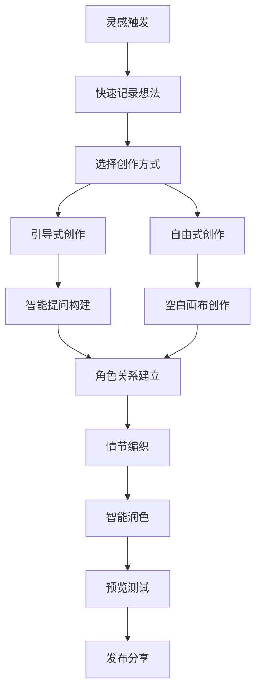
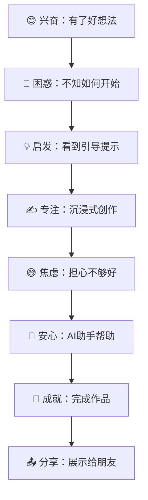

# 人性化剧本创作体验需求文档

## 1. 产品概述

重新设计剧本创作流程，从用户的创作心理和情感需求出发，打造一个充满灵感、直觉友好的剧本创建体验。让每个用户都能轻松地将脑海中的故事想法转化为精彩的剧本杀游戏。

## 2. 核心功能

### 2.1 用户角色

| 角色 | 创作动机 | 核心需求 |
|------|----------|----------|
| 新手创作者 | 想要尝试创作但不知从何开始 | 简单引导、模板参考、即时反馈 |
| 有经验创作者 | 有明确想法，需要高效工具 | 快速创建、灵活编辑、高级功能 |
| 灵感型创作者 | 突然有想法，想快速记录 | 一键开始、语音输入、智能补全 |

### 2.2 功能模块

我们的人性化创作系统包含以下核心页面：

1. **创作灵感页面**: 灵感触发器，创意启发，快速记录
2. **故事构建向导**: 分步引导，智能提问，渐进式创作
3. **角色生成器**: 性格测试式角色创建，关系网络可视化
4. **情节编织器**: 拖拽式情节构建，时间线可视化
5. **智能润色助手**: AI优化建议，风格调整，完整性检查

### 2.3 页面详情

| 页面名称 | 模块名称 | 功能描述 |
|----------|----------|----------|
| 创作灵感页面 | 灵感卡片 | 随机展示创作提示、热门元素、经典桥段，点击即可开始创作 |
| 创作灵感页面 | 快速记录 | 语音转文字、涂鸦板、关键词标签，捕捉瞬间灵感 |
| 故事构建向导 | 智能提问 | 像聊天一样询问故事背景、主题、氛围，逐步构建世界观 |
| 故事构建向导 | 选择式创作 | 提供多个选项让用户选择，降低创作门槛 |
| 角色生成器 | 性格问卷 | 通过有趣的问题生成角色性格，如"这个角色最害怕什么？" |
| 角色生成器 | 关系网络 | 可视化角色关系图，拖拽连线建立角色间的复杂关系 |
| 情节编织器 | 时间线编辑 | 直观的时间轴，拖拽事件调整顺序，实时预览故事流程 |
| 情节编织器 | 冲突生成器 | 基于角色关系自动建议可能的冲突点和转折 |
| 智能润色助手 | 风格检测 | 分析当前剧本风格，提供统一性建议 |
| 智能润色助手 | 完整性评估 | 检查剧本逻辑漏洞，提醒缺失的关键信息 |

## 3. 核心流程

### 灵感驱动的创作流程

### 情感化的用户旅程

## 4. 用户界面设计

### 4.1 设计理念

- **温暖感**: 使用暖色调渐变，营造舒适的创作氛围
- **直觉性**: 图标和交互符合用户直觉，减少学习成本
- **鼓励性**: 通过微动画和正向反馈鼓励用户继续创作
- **沉浸感**: 简洁界面让用户专注于创作本身
- **个性化**: 根据用户习惯调整界面布局和功能

### 4.2 创新交互设计

| 功能 | 交互方式 | 用户感受 |
|------|----------|----------|
| 灵感触发 | 摇一摇手机/点击魔法球 | 充满惊喜的发现 |
| 角色创建 | 拖拽头像到场景中 | 像玩游戏一样有趣 |
| 情节编织 | 卡片式拖拽排序 | 直观的故事构建 |
| 关系建立 | 连线画图 | 可视化思维导图 |
| 语音输入 | 长按说话按钮 | 自然的表达方式 |
| 智能建议 | 气泡提示悬浮 | 贴心的创作伙伴 |

### 4.3 情感化设计元素

- **进度庆祝**: 完成每个阶段都有小动画庆祝
- **创作伙伴**: AI助手有可爱的形象和个性化对话
- **成就系统**: 解锁创作徽章，记录创作里程碑
- **灵感日记**: 记录创作过程中的想法和感悟
- **作品展示**: 精美的作品卡片，增强成就感

## 5. 创新功能设计

### 5.1 "故事种子"系统

**概念**: 每个剧本都从一颗"故事种子"开始生长

**功能**:
- 🌱 **种子库**: 收集各种故事元素作为种子
- 🌿 **培育过程**: 通过回答问题让故事逐渐成长
- 🌳 **成长可视化**: 看到故事从种子长成大树的过程
- 🍎 **收获时刻**: 完成剧本时的成就感仪式

### 5.2 "角色对话"功能

**概念**: 让创作者与自己创造的角色对话

**功能**:
- 💬 **角色访谈**: AI扮演角色回答创作者的问题
- 🎭 **性格测试**: 通过对话了解角色的真实性格
- 🤝 **关系探索**: 让不同角色互相对话，发现关系动态
- 📝 **对话记录**: 保存有价值的对话作为剧本素材

### 5.3 "情节魔方"编辑器

**概念**: 像玩魔方一样组合情节元素

**功能**:
- 🎲 **情节块**: 每个情节是一个可旋转的立方体
- 🔄 **组合变化**: 旋转和重组产生不同的故事走向
- 🎯 **冲突检测**: 自动发现情节间的矛盾和机会
- 🌟 **惊喜生成**: 随机组合产生意想不到的情节转折

### 5.4 "创作心情"系统

**概念**: 根据创作者当前心情调整创作环境

**功能**:
- 😊 **心情识别**: 通过用户行为识别当前创作状态
- 🎵 **氛围音乐**: 匹配心情的背景音乐
- 🎨 **界面主题**: 动态调整颜色和布局
- 💡 **建议调整**: 根据心情提供不同类型的创作建议

## 6. 实施策略

### 6.1 用户测试驱动

**原则**: 每个功能都要经过真实用户测试

**方法**:
- 👥 **用户访谈**: 深入了解创作者的真实需求和痛点
- 🎯 **A/B测试**: 对比不同设计方案的用户反应
- 📊 **行为分析**: 观察用户的实际使用模式
- 💬 **反馈收集**: 建立快速反馈机制

### 6.2 渐进式发布

**Phase 1: 情感连接** (2-3周)
- 重新设计新建剧本的入口体验
- 实现"故事种子"基础功能
- 添加创作心情识别

**Phase 2: 直觉创作** (3-4周)
- 开发角色对话功能
- 实现情节魔方编辑器
- 优化语音输入体验

**Phase 3: 智能助手** (2-3周)
- 完善AI创作建议
- 添加成就系统
- 实现作品分享功能

### 6.3 持续优化

- 📈 **数据驱动**: 基于用户行为数据持续优化
- 🔄 **快速迭代**: 每周发布小的体验改进
- 🎨 **创意实验**: 定期尝试新的交互方式
- 👂 **用户声音**: 建立用户创作者社区，收集反馈

## 7. 成功指标

### 7.1 情感指标

- 😊 **创作愉悦度**: 用户创作过程中的满意度评分
- 🎯 **完成率**: 从开始到发布的剧本完成率
- 🔄 **回访率**: 用户再次使用创作功能的频率
- 💬 **分享意愿**: 用户主动分享作品的比例

### 7.2 行为指标

- ⏱️ **创作时长**: 用户单次创作的平均时间
- 🎲 **功能使用**: 各个创新功能的使用率
- 🔧 **自定义程度**: 用户个性化设置的使用情况
- 📱 **跨设备使用**: 移动端和桌面端的使用分布

这个设计方案将创作过程变成一场充满发现和惊喜的旅程，让每个用户都能享受到创作的乐趣，而不仅仅是完成一个任务。