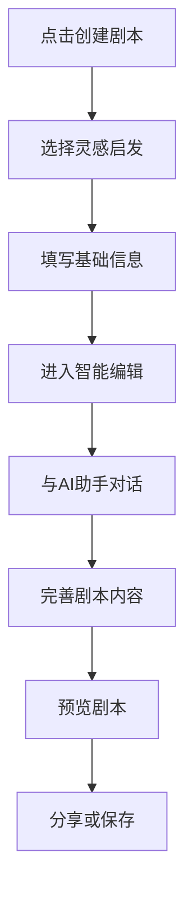

# AI剧本创作MVP需求文档

## 1. 产品概述

基于人性化剧本创作体验设计，筛选出最小可行产品(MVP)的核心功能。专注于用户创作的核心痛点，提供简单直观的剧本创建体验，验证产品核心价值假设。

## 2. 核心功能

### 2.1 用户角色

| 角色 | 访问方式 | 核心权限 |
|------|----------|----------|
| 默认用户 | 直接访问 | 创建和编辑剧本，使用AI辅助功能 |

### 2.2 功能模块

我们的MVP包含以下核心页面：

1. **快速创建页面**: 一键开始创作，灵感触发器，基础信息填写
2. **智能编辑页面**: 对话式创作助手，实时AI建议，简化编辑界面
3. **预览分享页面**: 剧本预览，基础分享功能

### 2.3 页面详情

| 页面名称 | 模块名称 | 功能描述 |
|----------|----------|----------|
| 快速创建页面 | 灵感启发器 | 提供3-5个创作起点：随机主题、图片灵感、一句话开始 |
| 快速创建页面 | 基础信息表单 | 剧本标题、类型选择、玩家人数、简单描述 |
| 智能编辑页面 | 对话式助手 | AI聊天界面，引导用户完善剧本内容 |
| 智能编辑页面 | 核心内容编辑 | 故事背景、角色设定、关键情节编辑 |
| 智能编辑页面 | 实时建议 | AI根据当前内容提供创作建议和补充 |
| 预览分享页面 | 剧本预览 | 格式化展示完整剧本内容 |
| 预览分享页面 | 基础分享 | 生成分享链接，导出基础格式 |

## 3. 核心流程

### MVP创作流程



## 4. 用户界面设计

### 4.1 设计风格

- **主色调**: 温暖的紫色渐变，营造创作氛围
- **按钮样式**: 圆角设计，微动画反馈
- **字体**: 清晰易读，层次分明
- **布局风格**: 简洁卡片式，专注内容创作
- **交互效果**: 平滑过渡，即时反馈

### 4.2 页面设计概览

| 页面名称 | 模块名称 | UI元素 |
|----------|----------|--------|
| 快速创建页面 | 灵感卡片 | 3个大卡片，图标+文字，悬停效果 |
| 快速创建页面 | 信息表单 | 简化表单，智能默认值，进度指示 |
| 智能编辑页面 | 聊天界面 | 类似微信的对话界面，AI头像，气泡样式 |
| 智能编辑页面 | 内容区域 | 分栏布局，左侧聊天，右侧内容预览 |
| 预览分享页面 | 预览卡片 | 精美的剧本展示卡片，关键信息突出 |

### 4.3 响应式设计

移动端优先设计，确保在手机上也能流畅创作。

## 5. MVP功能优先级

### 🔥 P0 - 核心必需功能

#### 快速创建入口
- **随机主题生成器**: 点击按钮获得创作主题
- **一句话开始**: 输入一句话，AI帮助扩展
- **基础信息收集**: 标题、类型、人数（最多4个字段）

#### 对话式创作助手
- **AI聊天界面**: 简单的问答式创作引导
- **智能提问**: AI主动询问剧本细节
- **内容生成**: 根据对话生成剧本片段

#### 基础编辑功能
- **故事背景编辑**: 简单文本框
- **角色列表**: 添加/编辑角色名称和简介
- **关键情节**: 3-5个关键情节点

#### 预览和保存
- **实时预览**: 边编辑边预览效果
- **本地保存**: 浏览器本地存储
- **基础导出**: 纯文本格式导出

### 🟡 P1 - 重要增强功能

#### 创作体验优化
- **自动保存**: 每30秒自动保存
- **撤销重做**: 基础的编辑历史
- **模板选择**: 2-3个剧本类型模板

#### AI功能增强
- **角色生成**: AI生成角色背景故事
- **情节建议**: 根据现有内容建议下一步情节
- **冲突生成**: 一键生成戏剧冲突

### 🟢 P2 - 未来扩展功能

#### 高级创作工具
- **时间线编辑器**: 可视化时间线
- **角色关系图**: 角色关系可视化
- **场景管理**: 场景列表和描述

#### 社交分享
- **精美分享卡片**: 社交媒体分享
- **创作社区**: 作品展示和交流
- **协作创作**: 多人同时编辑

## 6. 技术实现方案

### 6.1 MVP技术栈

**前端**:
- Next.js + React
- Tailwind CSS + shadcn/ui
- Zustand (状态管理)
- React Hook Form (表单)

**后端**:
- FastAPI
- SQLite (MVP阶段)
- OpenAI API (AI功能)

### 6.2 核心API设计

```
POST /api/scripts/quick-create    # 快速创建剧本
POST /api/ai/chat                 # AI对话接口
POST /api/ai/generate-content     # 内容生成
GET  /api/scripts/{id}            # 获取剧本
PUT  /api/scripts/{id}            # 更新剧本
```

### 6.3 数据模型

```python
class Script:
    id: int
    title: str
    type: str
    player_count: int
    description: str
    background: str
    characters: List[Character]
    plot_points: List[PlotPoint]
    created_at: datetime
    updated_at: datetime

class Character:
    name: str
    description: str
    
class PlotPoint:
    title: str
    description: str
    order: int
```

## 7. 开发计划

### Week 1-2: 基础架构
- 项目初始化和路由设置
- 基础UI组件开发
- 数据模型设计

### Week 3-4: 核心功能
- 快速创建页面
- AI聊天界面
- 基础编辑功能

### Week 5-6: 完善和测试
- 预览分享功能
- 用户体验优化
- 测试和bug修复

## 8. 成功指标

### 用户行为指标
- **创作完成率**: 用户从开始到完成一个剧本的比例 > 60%
- **AI交互次数**: 平均每个剧本的AI对话轮数 > 10次
- **创作时长**: 平均创作时间 < 30分钟

### 产品质量指标
- **用户满意度**: 创作体验评分 > 4.0/5.0
- **功能使用率**: 核心功能使用率 > 80%
- **错误率**: 系统错误率 < 1%

## 9. 风险和假设

### 核心假设
1. 用户愿意通过对话方式创作剧本
2. AI能够提供有价值的创作建议
3. 简化的创作流程能满足基本需求

### 主要风险
1. AI生成内容质量不稳定
2. 用户学习成本过高
3. 创作流程过于简化，无法满足深度需求

### 验证方法
- 用户访谈和可用性测试
- A/B测试不同的创作流程
- 数据分析用户行为模式

这个MVP版本专注于验证核心价值假设：用户是否喜欢对话式的剧本创作体验，以及AI辅助是否能真正帮助用户创作出满意的剧本。