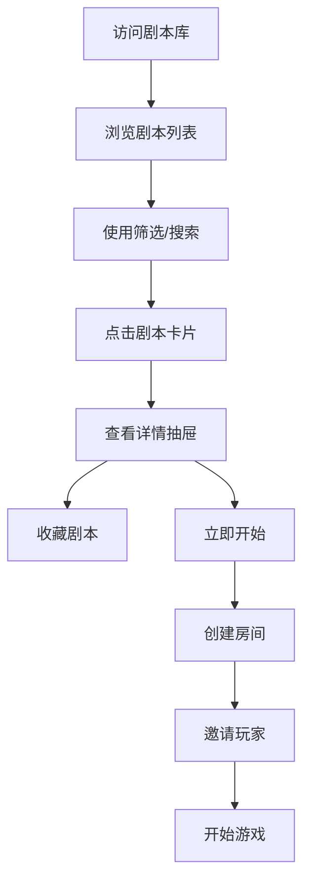
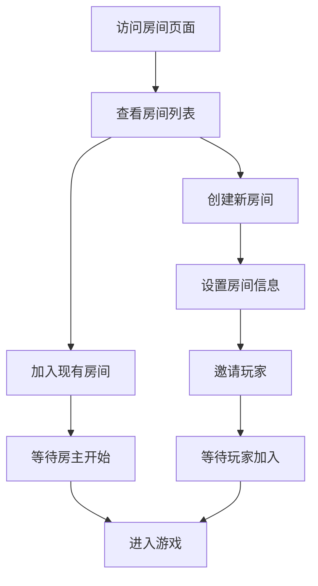
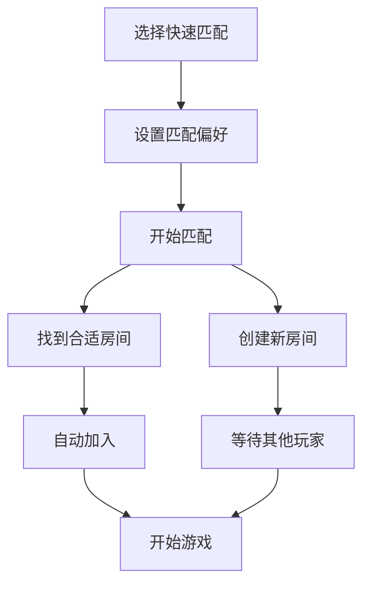

# 剧本库与房间管理系统需求文档

## 1. 产品概述

重构AI剧本杀平台的剧本浏览和房间管理功能，将原有的首页集成式设计拆分为专业的剧本库页面和独立的房间管理系统。通过清晰的信息架构和优化的用户流程，提升用户的剧本发现和游戏组织体验。

## 2. 核心功能

### 2.1 用户角色

| 角色 | 访问方式 | 核心权限 |
|------|----------|----------|
| 游客用户 | 直接访问 | 浏览剧本库，查看剧本详情，无法创建房间 |
| 注册用户 | 登录访问 | 完整剧本库功能，房间创建/管理，游戏参与 |
| 房主用户 | 创建房间 | 房间设置管理，玩家邀请，游戏开始控制 |

### 2.2 功能模块

我们的系统包含以下核心页面：

1. **剧本库页面**: 剧本浏览，搜索筛选，详情查看，收藏管理
2. **剧本详情抽屉**: 详细信息展示，快速操作，相关推荐
3. **房间管理页面**: 房间列表，状态管理，快速匹配
4. **房间详情页面**: 房间设置，玩家管理，游戏准备
5. **首页优化**: 简化为品牌展示和快速入口

### 2.3 页面详情

| 页面名称 | 模块名称 | 功能描述 |
|----------|----------|----------|
| 剧本库页面 | 剧本网格 | 卡片式展示剧本，支持网格/列表视图切换，悬停预览 |
| 剧本库页面 | 筛选系统 | 多维度筛选：难度、人数、时长、类型、评分 |
| 剧本库页面 | 搜索功能 | 关键词搜索，标签搜索，高级搜索选项 |
| 剧本详情抽屉 | 基本信息 | 剧本介绍、角色信息、游戏规则、评分评价 |
| 剧本详情抽屉 | 快速操作 | 收藏、分享、立即开始、查看评论 |
| 房间管理页面 | 房间列表 | 我的房间、公开房间、房间搜索、状态筛选 |
| 房间管理页面 | 快速匹配 | 智能匹配系统，偏好设置，一键加入 |
| 房间详情页面 | 房间设置 | 房间信息、游戏配置、隐私设置 |
| 房间详情页面 | 玩家管理 | 玩家列表、角色分配、踢出功能 |

## 3. 核心流程

### 剧本发现流程



### 房间管理流程



### 快速匹配流程



## 4. 用户界面设计

### 4.1 设计风格

- **主色调**: 深紫色渐变主题，保持品牌一致性
- **按钮样式**: 现代圆角设计，渐变背景，微交互动画
- **字体**: 清晰的层次结构，标题粗体，正文中等字重
- **布局风格**: 卡片式设计，网格布局，响应式适配
- **交互效果**: 平滑过渡，悬停反馈，加载状态

### 4.2 页面设计概览

| 页面名称 | 模块名称 | UI元素 |
|----------|----------|--------|
| 剧本库页面 | 顶部导航 | 面包屑，视图切换，搜索框，筛选按钮 |
| 剧本库页面 | 侧边筛选 | 折叠式筛选面板，多选框，滑块，标签 |
| 剧本库页面 | 剧本网格 | 响应式网格，剧本卡片，悬停效果，分页 |
| 剧本详情抽屉 | 头部信息 | 剧本标题，评分，标签，操作按钮 |
| 剧本详情抽屉 | 内容区域 | 标签页切换，详细描述，角色信息，评论 |
| 房间管理页面 | 房间卡片 | 房间状态，玩家信息，快速操作，进度条 |
| 房间管理页面 | 创建按钮 | 浮动操作按钮，快速创建表单 |

### 4.3 响应式设计

- **桌面端**: 多列网格布局，侧边筛选面板，详情抽屉
- **平板端**: 两列布局，折叠式筛选，模态详情
- **移动端**: 单列布局，底部筛选，全屏详情

## 5. 技术实现方案

### 5.1 页面路由设计

```
/scripts              - 剧本库主页
/scripts?category=    - 分类浏览
/scripts?search=      - 搜索结果
/rooms               - 房间管理页
/rooms/create        - 创建房间
/rooms/[id]          - 房间详情
/rooms/[id]/game     - 游戏页面
```

### 5.2 组件架构

**剧本库相关组件**:
- `ScriptLibrary`: 剧本库主页面
- `ScriptGrid`: 剧本网格展示
- `ScriptCard`: 剧本卡片组件
- `ScriptDetailDrawer`: 详情抽屉
- `ScriptFilters`: 筛选组件
- `SearchBar`: 搜索组件

**房间管理相关组件**:
- `RoomManagement`: 房间管理主页
- `RoomList`: 房间列表
- `RoomCard`: 房间卡片
- `CreateRoomModal`: 创建房间模态框
- `RoomDetail`: 房间详情页
- `QuickMatch`: 快速匹配组件

### 5.3 状态管理

**剧本相关状态**:
- `scriptsStore`: 剧本列表，筛选状态，搜索结果
- `scriptDetailStore`: 当前查看的剧本详情
- `favoritesStore`: 用户收藏的剧本

**房间相关状态**:
- `roomsStore`: 房间列表，房间状态
- `currentRoomStore`: 当前房间信息
- `matchingStore`: 匹配状态和偏好

### 5.4 API接口设计

**剧本相关接口**:
```
GET /api/scripts              - 获取剧本列表
GET /api/scripts/{id}         - 获取剧本详情
GET /api/scripts/search       - 搜索剧本
POST /api/scripts/{id}/favorite - 收藏剧本
```

**房间相关接口**:
```
GET /api/rooms                - 获取房间列表
POST /api/rooms               - 创建房间
GET /api/rooms/{id}           - 获取房间详情
POST /api/rooms/{id}/join     - 加入房间
POST /api/rooms/match         - 快速匹配
```

## 6. 实施计划

### Phase 1: 基础架构 (1-2周)
1. 创建新的页面路由结构
2. 实现剧本库主页面和基础组件
3. 创建房间管理页面框架
4. 设置状态管理和API集成

### Phase 2: 核心功能 (2-3周)
1. 完善剧本详情抽屉组件
2. 实现筛选和搜索功能
3. 开发房间创建和管理功能
4. 添加快速匹配系统

### Phase 3: 体验优化 (1-2周)
1. 优化响应式设计
2. 添加动画和交互效果
3. 实现收藏和个性化功能
4. 性能优化和测试

### Phase 4: 高级功能 (1-2周)
1. 添加评论和评分系统
2. 实现社交分享功能
3. 优化推荐算法
4. 添加数据分析和监控

## 7. 成功指标

### 7.1 用户体验指标
- **剧本发现效率**: 用户找到心仪剧本的平均时间 < 2分钟
- **房间创建成功率**: > 95%
- **匹配成功率**: > 80%
- **页面加载时间**: < 2秒

### 7.2 业务指标
- **剧本浏览深度**: 平均查看剧本数量增加50%
- **房间创建率**: 提升30%
- **游戏开始转化率**: 提升25%
- **用户留存率**: 7日留存提升20%

### 7.3 技术指标
- **代码复用率**: > 80%
- **组件测试覆盖率**: > 90%
- **API响应时间**: < 500ms
- **错误率**: < 1%

这个新的架构将显著提升用户的剧本发现和房间管理体验，为平台的长期发展奠定坚实基础。