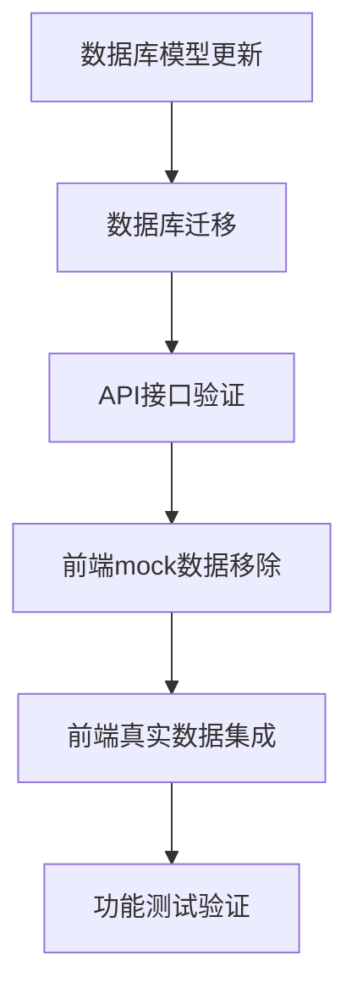

## 1. Product Overview
剧本库数据库集成改进方案，旨在将前端mock数据替换为真实数据库数据，并添加必要的字段以支持完整的剧本展示功能。
- 解决前端使用mock数据的问题，实现与后端数据库的完整集成
- 为剧本库添加评分、分类、图片等展示所需的关键字段
- 提升用户体验，提供真实可靠的剧本数据展示

## 2. Core Features

### 2.1 Feature Module
本需求涉及以下核心模块的改进：
1. **数据库模型扩展**：为ScriptInfo模型添加缺失字段
2. **API接口优化**：确保新字段在API响应中正确返回
3. **前端数据适配**：移除mock数据，使用真实API数据
4. **数据迁移脚本**：为现有数据添加默认值

### 2.2 Page Details

| Page Name | Module Name | Feature description |
|-----------|-------------|---------------------|
| 数据库模型 | ScriptInfo扩展 | 添加rating(评分)、category(分类)、play_count(游玩次数)、image_url(封面图)等字段 |
| API接口 | 剧本列表接口 | 确保新增字段在getScriptsApiScriptsGet接口中正确返回 |
| 前端首页 | 剧本展示组件 | 移除convertScriptInfo中的mock数据生成，直接使用API返回的真实数据 |
| 前端剧本页 | 剧本列表组件 | 替换mockScripts数组，使用ScriptsService获取真实数据 |
| 数据迁移 | 数据库更新 | 为现有剧本记录添加默认的评分、分类等信息 |

## 3. Core Process

### 数据库集成流程
1. **数据库模型更新**：在ScriptInfo模型中添加rating、category、play_count、image_url等字段
2. **数据库迁移**：为现有剧本数据添加默认值
3. **API接口验证**：确保新字段在API响应中正确序列化
4. **前端适配**：移除mock数据，使用真实API数据
5. **测试验证**：确保数据显示正确且功能完整

## 4. User Interface Design

### 4.1 Design Style
- **保持现有设计风格**：不改变当前的UI设计
- **数据展示优化**：确保新的真实数据能够正确显示
- **加载状态处理**：添加适当的loading和error状态
- **响应式适配**：确保在不同设备上正确显示

### 4.2 Page Design Overview

| Page Name | Module Name | UI Elements |
|-----------|-------------|-------------|
| 首页 | 剧本展示卡片 | 显示真实的评分、游玩次数、封面图片等信息 |
| 剧本库页面 | 剧本列表 | 使用真实的分类、标签、评分数据进行筛选和展示 |
| 剧本详情 | 详情弹窗 | 展示完整的剧本信息，包括真实的统计数据 |

### 4.3 Responsiveness
保持现有的响应式设计，确保新的数据字段在移动端和桌面端都能正确显示。

## 5. Technical Implementation Details

### 5.1 数据库字段添加
需要在ScriptInfo模型中添加以下字段：
- `rating: float` - 剧本评分 (0-5分)
- `category: str` - 剧本分类 (推理、悬疑、科幻等)
- `play_count: int` - 游玩次数统计
- `image_url: str` - 剧本封面图片URL

### 5.2 前端Mock数据移除
需要移除以下文件中的mock数据：
- `frontend/src/stores/scriptsStore.ts` - mockScripts数组
- `frontend/src/pages/scripts.tsx` - mockScripts数组
- `frontend/src/pages/index.tsx` - convertScriptInfo中的模拟数据生成

### 5.3 API集成优化
确保ScriptsService.getScriptsApiScriptsGet()返回的数据包含所有必要字段，并在前端正确处理。