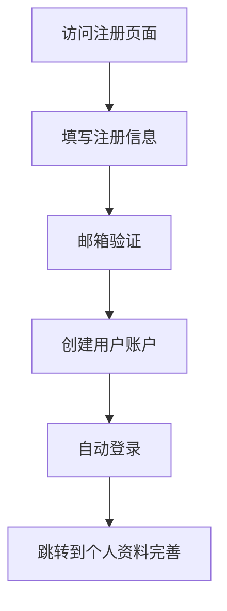
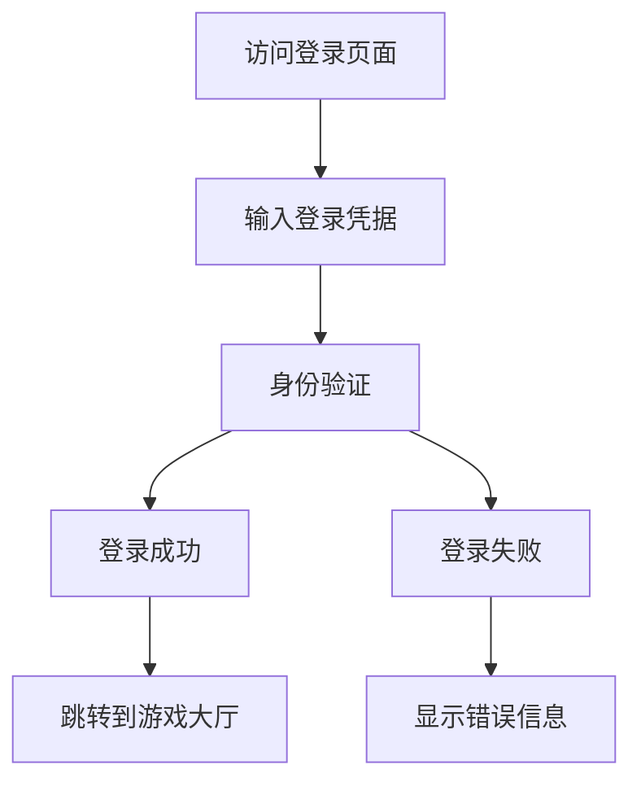
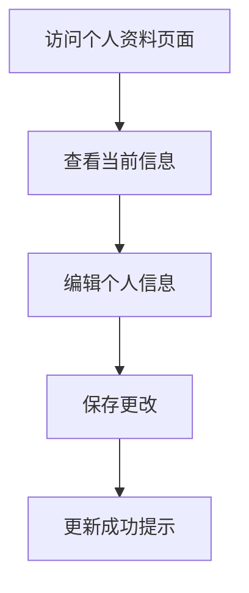

# 用户系统需求文档

## 1. 产品概述

在现有剧本杀游戏平台基础上，新增完整的用户系统，包括用户注册、登录认证和个人资料管理功能。该系统将为用户提供个性化的游戏体验，支持游戏历史记录、好友系统和个人设置等功能。

## 2. 核心功能

### 2.1 用户角色

| 角色   | 注册方式 | 核心权限                 |
| ---- | ---- | -------------------- |
| 游客用户 | 无需注册 | 可以浏览剧本，参与游戏但无法保存记录   |
| 注册用户 | 邮箱注册 | 完整游戏功能，个人资料管理，游戏历史记录 |
| 管理员  | 系统分配 | 用户管理，剧本管理，系统配置       |

### 2.2 功能模块

我们的用户系统包含以下核心页面：

1. **用户注册页面**: 邮箱注册表单，验证码验证，用户协议确认
2. **用户登录页面**: 登录表单，记住密码，忘记密码链接
3. **个人资料页面**: 用户信息展示和编辑，头像上传，密码修改
4. **用户设置页面**: 游戏偏好设置，隐私设置，通知设置
5. **游戏历史页面**: 历史游戏记录，统计数据，成就展示

### 2.3 页面详情

| 页面名称   | 模块名称 | 功能描述                           |
| ------ | ---- | ------------------------------ |
| 用户注册页面 | 注册表单 | 收集用户基本信息：用户名、邮箱、密码，进行表单验证和重复检查 |
| 用户注册页面 | 验证系统 | 发送邮箱验证码，验证用户邮箱有效性              |
| 用户登录页面 | 登录表单 | 用户名/邮箱和密码登录，记住登录状态             |
| 用户登录页面 | 密码重置 | 忘记密码时通过邮箱重置密码                  |
| 个人资料页面 | 基本信息 | 显示和编辑用户昵称、头像、个人简介等信息           |
| 个人资料页面 | 安全设置 | 修改密码，绑定邮箱，账户安全设置               |
| 用户设置页面 | 游戏偏好 | 语音设置，界面主题，游戏难度偏好               |
| 用户设置页面 | 隐私设置 | 个人信息可见性，游戏记录公开性设置              |
| 游戏历史页面 | 历史记录 | 展示用户参与的游戏列表，包括时间、剧本、角色、结果      |
| 游戏历史页面 | 统计数据 | 游戏次数、胜率、最喜欢的角色类型等统计信息          |

## 3. 核心流程

### 用户注册流程

### 用户登录流程

### 个人资料管理流程

## 4. 用户界面设计

### 4.1 设计风格

* **主色调**: 紫色渐变 (#6366f1 到 #8b5cf6)，保持与现有游戏界面一致

* **按钮样式**: 圆角按钮，渐变背景，悬停动画效果

* **字体**: 系统默认字体，标题使用 font-bold，正文使用 font-medium

* **布局风格**: 卡片式布局，毛玻璃效果背景，响应式设计

* **图标风格**: 使用 Lucide React 图标库，简洁现代风格

### 4.2 页面设计概览

| 页面名称   | 模块名称   | UI元素                         |
| ------ | ------ | ---------------------------- |
| 用户注册页面 | 注册表单   | 居中卡片布局，渐变背景，表单验证提示，提交按钮带加载状态 |
| 用户登录页面 | 登录表单   | 简洁登录框，记住密码复选框，忘记密码链接，第三方登录按钮 |
| 个人资料页面 | 用户信息卡片 | 头像上传区域，信息编辑表单，保存按钮，标签页切换     |
| 用户设置页面 | 设置面板   | 分类设置选项，开关组件，下拉选择器，颜色选择器      |
| 游戏历史页面 | 历史记录表格 | 数据表格，分页组件，筛选器，统计图表           |

### 4.3 响应式设计

桌面优先设计，完全适配移动端，支持触摸交互优化。在移动端使用全屏模态框替代侧边栏，优化表单输入体验。

## 5. 技术实现方案

### 5.1 后端实现

**数据库模型**:

* User 模型：用户基本信息

* UserProfile 模型：用户详细资料

* UserSession 模型：用户会话管理

* GameHistory 模型：游戏历史记录

**API 路由**:

* `/api/auth/register` - 用户注册

* `/api/auth/login` - 用户登录

* `/api/auth/logout` - 用户登出

* `/api/users/profile` - 个人资料管理

* `/api/users/settings` - 用户设置

* `/api/users/history` - 游戏历史

**安全措施**:

* JWT Token 认证

* 密码哈希存储

* 邮箱验证

* 请求频率限制

### 5.2 前端实现

**页面组件**:

* RegisterPage：注册页面

* LoginPage：登录页面

* ProfilePage：个人资料页面

* SettingsPage：设置页面

* HistoryPage：历史记录页面

**状态管理**:

* userStore：用户信息和认证状态

* authStore：登录状态管理

* settingsStore：用户设置管理

**路由保护**:

* 私有路由组件

* 认证中间件

* 权限检查

### 5.3 集成方案

**与现有系统集成**:

* 游戏会话关联用户ID

* 游戏记录自动保存

* 用户偏好设置应用到游戏中

* WebSocket 连接携带用户认证信息

