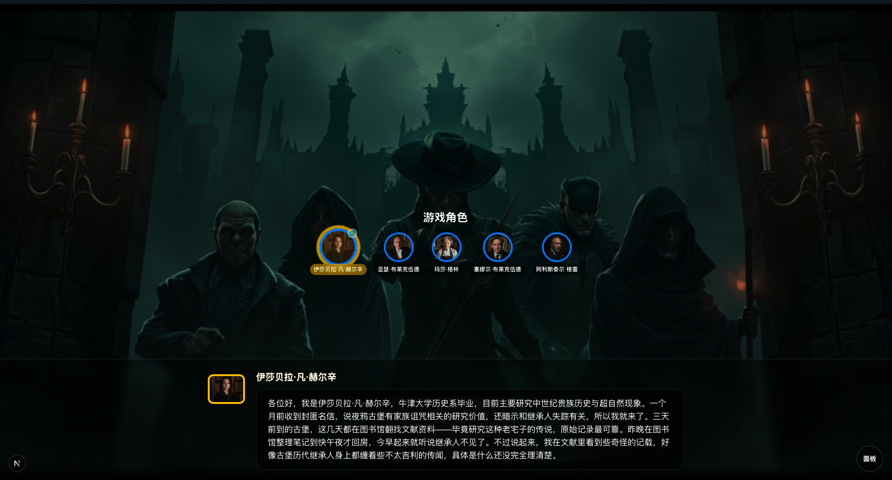
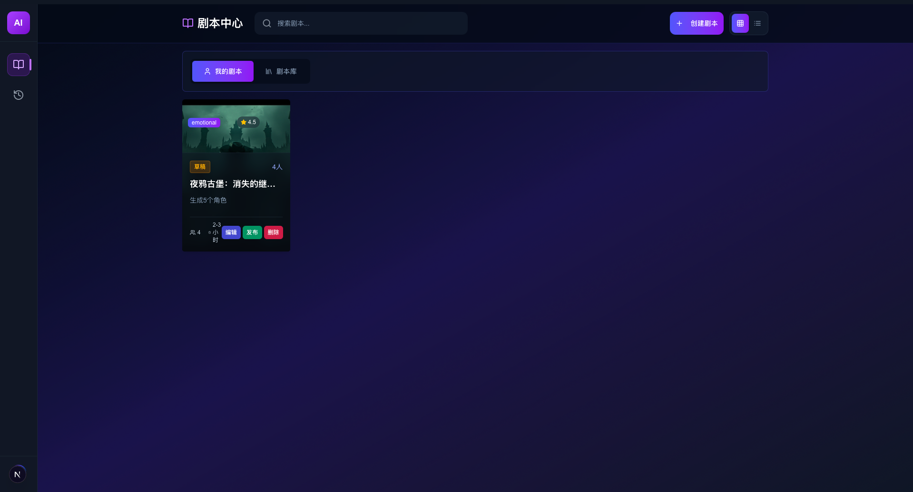
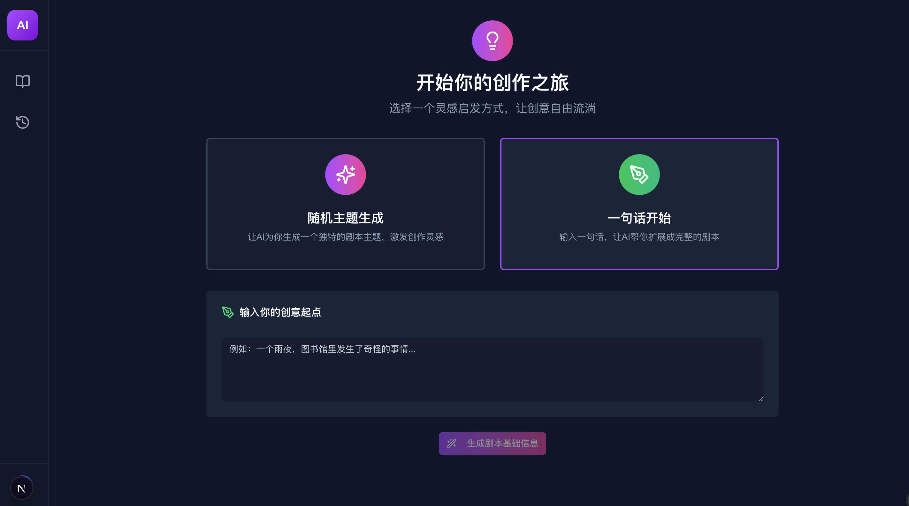

# 🎭 AI Murder Mystery Game (JubenSha)

[中文版本](README.md)

An AI-powered murder mystery game system where all characters are played by AI. The project consists of both frontend and backend components, built with modern technology stacks.

## 🌟 Key Features

- 🤖 **Full AI Character Play** - All characters are driven by AI with unique backgrounds and secrets
- 🎯 **Complete Game Flow** - Includes background introduction, self-introduction, evidence collection, investigation, discussion, voting, truth revelation, and other complete stages
- 🌐 **Real-time Synchronization** - Uses WebSocket to achieve real-time game state synchronization
- 💻 **Modern Interface** - Responsive web interface with mobile access support
- 🧠 **Intelligent Reasoning Engine** - AI reasoning capabilities based on large language models
- 🔊 **TTS Voice Broadcasting** - Text-to-speech support for enhanced immersive experience
- 🎨 **AI Image Generation** - Supports AI-generated character avatars, evidence images, and scene pictures
- ✏️ **AI Script Editing** - Supports AI generation and editing of script content

## 📸 Screenshots

<div style="display: flex; flex-direction: column; gap: 20px;">
  <div style="display: flex; justify-content: space-between; gap: 20px;">
    
    
  </div>
  <div style="display: flex; justify-content: space-between; gap: 20px;">
    
    
  </div>
</div>

## 🚀 Core Functions

### AI Script Generation and Editing
- Automatically generates complete murder mystery content, including background stories, character settings, evidence design, and scene descriptions
- Supports natural language commands to edit scripts, such as "add a kind character" or "modify the murderer's motive"
- Allows随时 adjustment of script content, with AI automatically adapting to modifications while maintaining logical consistency

### AI Plot Deduction
- Fully automatic AI-driven game flow without human participation
- 8 game stages: background introduction, self-introduction, evidence collection, investigation, free discussion, voting, truth revelation, and game end
- Each AI character has unique personality and secrets, capable of natural dialogue and reasoning

### TTS Voice Synthesis
- MiniMax API: Supports multiple languages and voices
- [CosyVoice 2.0](https://github.com/journey-ad/CosyVoice2-Ex): Local deployment of Chinese voice synthesis service

### Text-to-Image Services
Supports multiple image generation services:
- ComfyUI: Locally deployed stable diffusion image generation platform
- MiniMax API: Cloud-based image generation service

### Large Language Model (LLM) Support
Compatible with all OpenAI API-compatible large language models

## 📁 Project Structure

```
jubensha/
├── backend/     # Backend services
│   ├── src/     # Core source code
│   ├── docs/    # Documentation
│   └── tests/   # Test code
└── frontend/    # Frontend interface
    ├── src/     # Frontend source code
    └── public/  # Static resources
```

## 🚀 Quick Start

### Environment Preparation

#### Backend Services
- Python 3.13+
- uv (Python package manager)
- PostgreSQL database
- At least one AI service API key (OpenAI compatible models, TTS services, image generation services, etc.)

#### Frontend Interface
- Node.js 18+
- npm or yarn

### Configuration and Running

#### 1. Backend Service Configuration and Running

1. **Enter backend directory**
   ```bash
   cd backend
   ```

2. **Install dependencies**
   ```bash
   uv sync
   ```

3. **Configure environment variables**
   
   Copy and edit the `.env` file:
   ```bash
   cp .env.example .env
   # Edit the .env file to set your API keys and other configurations
   ```
   
   Configure necessary API keys in the `.env` file:
   - `OPENAI_API_KEY` or other LLM service keys
   - `TTS_API_KEY` and `TTS_PROVIDER` (such as cosyvoice2-ex or minimax)
   - `MINIMAX_API_KEY` (if using MiniMax image generation or TTS services)
   - Database connection information

4. **Initialize database**
   ```bash
   # Perform database migration and initialization according to project documentation
   ```

5. **Run backend service**
   ```bash
   uv run python main.py
   ```

#### 2. Frontend Interface Configuration and Running

1. **Enter frontend directory**
   ```bash
   cd frontend
   ```

2. **Install dependencies**
   ```bash
   npm install
   ```

3. **Configure environment variables**
   
   Copy and edit the `.env` file:
   ```bash
   cp .env.example .env
   # Edit the .env file to set backend API address
   ```

4. **Run frontend development server**
   ```bash
   npm run dev
   ```

5. **Build production version**
   ```bash
   npm run build
   npm run start
   ```

## 🎮 Game Flow

1. **Background Introduction Stage** - System narrates the case background story
2. **Self-introduction Stage** - AI characters introduce their identity and background one by one
3. **Evidence Collection Stage** - AI characters search scenes and discover evidence
4. **Investigation Stage** - AI characters ask each other questions to advance investigation
5. **Free Discussion Stage** - AI characters share reasoning and counter arguments
6. **Voting Stage** - AI characters vote to identify the murderer
7. **Truth Revelation Stage** - Announce the case truth and game results

## 🛠 Technical Architecture

### Backend Technology Stack
- **FastAPI** - Modern, fast (high-performance) web framework
- **LangChain** - Framework for building AI applications
- **OpenAI/Compatible Models** - Large language model support
- **PostgreSQL** - Relational database
- **WebSocket** - Real-time bidirectional communication
- **MinIO** - Object storage service

### Frontend Technology Stack
- **Next.js 15** - React framework
- **React 19** - Frontend UI library
- **TypeScript** - JavaScript superset
- **Tailwind CSS** - CSS framework
- **Zustand** - State management
- **Radix UI** - Unstyled component library

## 📝 Development Plan

Future optimization directions include:

### Script Generation and Editing Features
- Enhance AI script generation capabilities to support more complex plot structures
- Optimize script editing experience with more intuitive editing interface
- Support more types of script templates and customization options
- Improve AI's ability to maintain script logical consistency

### UI Interaction Optimization
- Improve user interface design to enhance user experience
- Optimize mobile adaptation and interaction effects
- Enhance visual feedback during gameplay
- Provide smoother operation flow and animation effects

### Multilingual Support
- Support internationalization and multilingual switching
- Support multiple languages including Chinese and English

## 📄 License

This project is licensed under the MIT License - see the [LICENSE](LICENSE) file for details.
You are free to:
- Use this software for commercial purposes
- Modify and distribute this software
- Use part or all of this software's code in your projects

## 🤝 Contribution

Welcome to submit Issues and Pull Requests to improve the project.