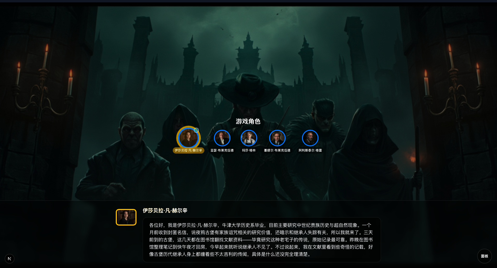
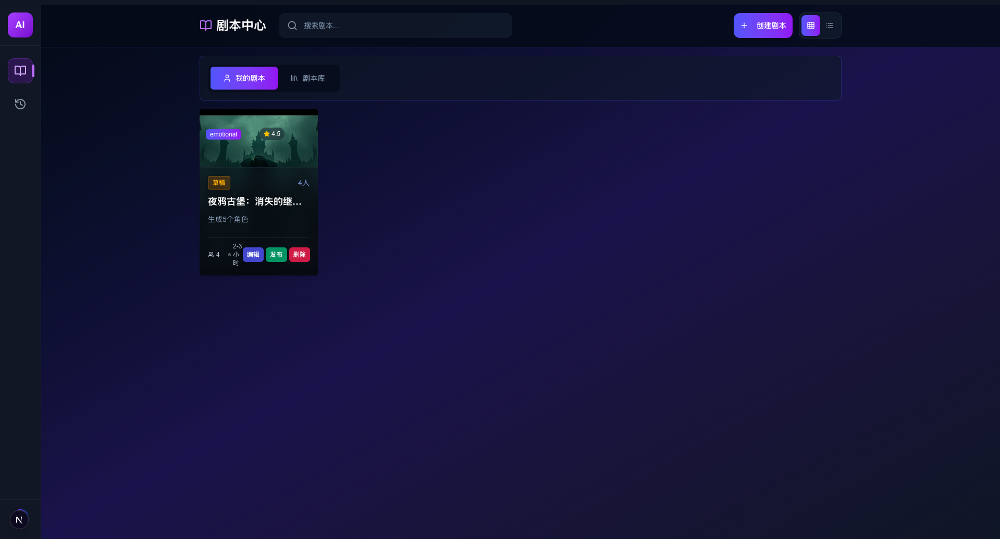

# 🎭 AI剧本杀游戏 (JubenSha)

一个基于AI的剧本杀游戏系统，所有角色均由AI扮演。项目包含前端和后端两个部分，采用现代化技术栈构建。

## 🌟 项目特色

- 🤖 **全AI角色扮演** - 所有角色均由AI驱动，具有独特背景和秘密
- 🎯 **完整游戏流程** - 包含背景介绍、自我介绍、搜证、调查、讨论、投票、揭晓真相等完整阶段
- 🌐 **实时同步体验** - 使用WebSocket实现实时游戏状态同步
- 💻 **现代化界面** - 响应式Web界面，支持移动端访问
- 🧠 **智能推理引擎** - 基于大语言模型的AI推理能力
- 🔊 **TTS语音播报** - 支持文本转语音，增强沉浸式体验
- 🎨 **AI图像生成** - 支持AI生成角色头像、证据图片和场景图片
- ✏️ **AI剧本编辑** - 支持AI生成和编辑剧本内容

## 📸 屏幕截图

<div style="display: flex; justify-content: space-between; gap: 20px;">
  
  
</div>

## 🚀 核心功能

### AI剧本生成与编辑
- 自动生成完整剧本杀内容，包括背景故事、角色设定、证据设计和场景描述
- 支持自然语言指令编辑剧本，如"添加一个善良的角色"或"修改凶手的动机"
- 可以随时调整剧本内容，AI会自动适应修改并保持逻辑一致性

### AI剧情推演
- 全自动AI驱动游戏流程，无需真人参与
- 8个游戏阶段：背景介绍、自我介绍、搜证、调查取证、自由讨论、投票表决、真相揭晓、游戏结束
- 每个AI角色都有独特性格和秘密，能够进行自然对话和推理

### TTS语音合成
支持多种TTS服务：
- CosyVoice 2.0: 高质量中文语音合成
- MiniMax API: 支持多种语言和声音

### 文生图服务
支持多种图像生成服务：
- ComfyUI: 本地部署的稳定扩散图像生成平台
- MiniMax API: 云端图像生成服务

### 大语言模型(LLM)支持
兼容所有OpenAI API兼容的大语言模型：


## 📁 项目结构

```
jubensha/
├── backend/     # 后端服务
│   ├── src/     # 核心源码
│   ├── docs/    # 文档资料
│   └── tests/   # 测试代码
└── frontend/    # 前端界面
    ├── src/     # 前端源码
    └── public/  # 静态资源
```

## 🚀 快速开始

### 环境准备

#### 后端服务
- Python 3.13+
- uv (Python包管理器)
- PostgreSQL数据库
- 至少一个AI服务API密钥（OpenAI兼容模型、TTS服务、图像生成服务等）

#### 前端界面
- Node.js 18+
- npm 或 yarn

### 配置与运行

#### 1. 后端服务配置与运行

1. **进入后端目录**
   ```bash
   cd backend
   ```

2. **安装依赖**
   ```bash
   uv sync
   ```

3. **配置环境变量**
   
   复制并编辑 `.env` 文件：
   ```bash
   cp .env.example .env
   # 编辑 .env 文件设置你的API密钥和其他配置
   ```
   
   在 `.env` 文件中配置必要的API密钥：
   - `OPENAI_API_KEY` 或其他LLM服务密钥
   - `TTS_API_KEY` 和 `TTS_PROVIDER` (如cosyvoice2-ex或minimax)
   - `MINIMAX_API_KEY` (如果使用MiniMax的图像生成或TTS服务)
   - 数据库连接信息

4. **初始化数据库**
   ```bash
   # 根据项目文档进行数据库迁移和初始化
   ```

5. **运行后端服务**
   ```bash
   uv run python main.py
   ```

#### 2. 前端界面配置与运行

1. **进入前端目录**
   ```bash
   cd frontend
   ```

2. **安装依赖**
   ```bash
   npm install
   ```

3. **配置环境变量**
   
   复制并编辑 `.env` 文件：
   ```bash
   cp .env.example .env
   # 编辑 .env 文件设置后端API地址
   ```

4. **运行前端开发服务器**
   ```bash
   npm run dev
   ```

5. **构建生产版本**
   ```bash
   npm run build
   npm run start
   ```

## 🎮 游戏流程

1. **背景介绍阶段** - 系统叙述案件背景故事
2. **自我介绍阶段** - AI角色依次介绍自己的身份背景
3. **搜证阶段** - AI角色搜查场景发现证据
4. **调查取证阶段** - AI角色互相提问推进调查
5. **自由讨论阶段** - AI角色分享推理和反驳观点
6. **投票表决阶段** - AI角色投票指认凶手
7. **真相揭晓阶段** - 公布案件真相和游戏结果

## 🛠 技术架构

### 后端技术栈
- **FastAPI** - 现代、快速(高性能)的Web框架
- **LangChain** - 构建AI应用的框架
- **OpenAI/兼容模型** - 大语言模型支持
- **PostgreSQL** - 关系型数据库
- **WebSocket** - 实时双向通信
- **MinIO** - 对象存储服务

### 前端技术栈
- **Next.js 15** - React框架
- **React 19** - 前端UI库
- **TypeScript** - JavaScript超集
- **Tailwind CSS** - CSS框架
- **Zustand** - 状态管理
- **Radix UI** - 无样式组件库

## 📝 开发计划

未来的优化方向包括：

### 剧本生成和编辑功能
- 增强AI剧本生成能力，支持更复杂的剧情结构
- 优化剧本编辑体验，提供更直观的编辑界面
- 支持更多类型的剧本模板和自定义选项
- 提升AI对剧本逻辑一致性的维护能力

### UI交互优化
- 改进用户界面设计，提升用户体验
- 优化移动端适配和交互效果
- 增强游戏过程中的可视化反馈
- 提供更流畅的操作流程和动画效果

### 多语言支持
- 支持国际化和多语言切换
- 支持中英文等多语言界面

## 📄 许可证

本项目采用 MIT 许可证 - 参见 [LICENSE](LICENSE) 文件了解详细信息。
您可以自由地：
- 使用本软件用于商业目的
- 修改和分发本软件
- 在您的项目中使用本软件的部分或全部代码

## 🤝 贡献

欢迎提交Issue和Pull Request来改进项目。